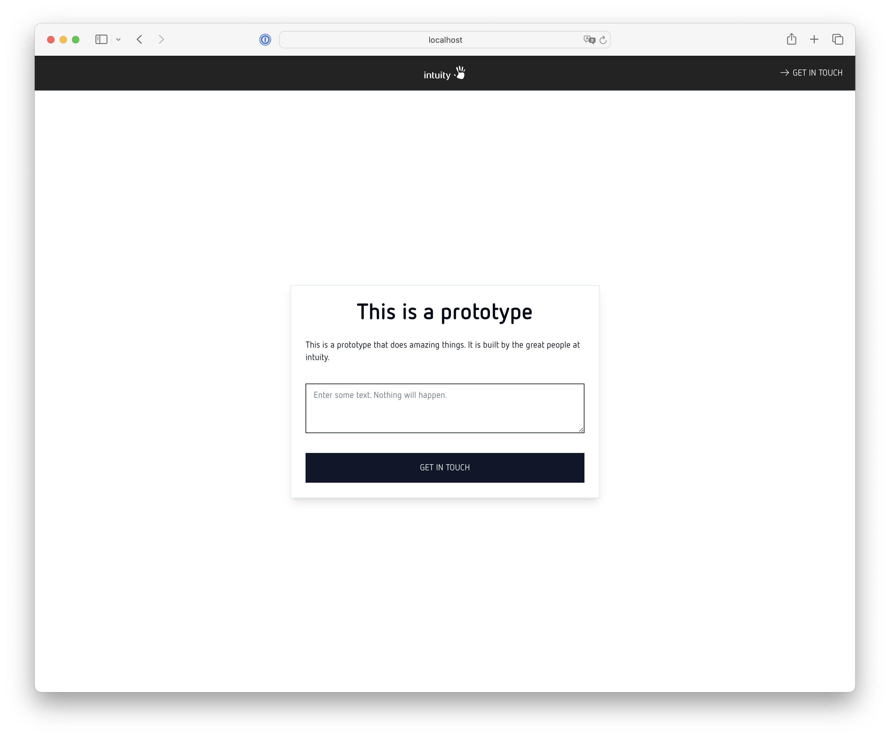

# ity-prototype-template

owner: maximilian hans (maximilian.hans@intuity.de)



## Getting Started

First, run the development server:

```bash
pnpm install
pnpm dev
```

Open [  ](http://localhost:3000) with your browser to see the result.

## Stack

- Next 14
- Modified Shadcn Component Library -> [ui.shadcn.com](https://ui.shadcn.com/)
- Styling mainly via globals.css and **only if necessary** by modifying components directly
